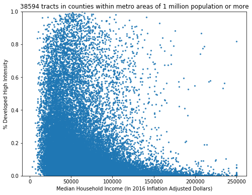

# NLCD + ACS

In this repository I calculate National Land Cover Database (NLCD) land cover class frequencies over US census tract geographies and join those frequencies to American Community Survey (ACS) data (also over US census tracts). Specifically I join the 2011, 2013, and 2016 NLCD layers to the respective ACS 5-year survey data. This joint dataset allows for analysis of land cover *and* socioeconmic data. For example, we can calculate the correlation between the fraction of "Developed High Intensity" land in a census tract and the median income of that tract in urbanized counties:

  

## Pre-processed data
To avoid having to download all raw data and compute the NLCD to ACS Census Tract join, download the [processed.zip](https://www.dropbox.com/s/dt3c3uhpmgz2u2u/processed.zip?dl=0) file and unzip it into the `data/` directory. As a sanity check, after you do this, the file `data/processed/acs_5yr_2011_nlcd_joined_data.csv` should exist.

## Data Sources
- Rural-Urban Continuum Codes - https://www.ers.usda.gov/data-products/rural-urban-continuum-codes.aspx
- National Land Cover Database - https://www.mrlc.gov/data
- American Community Survey 5-year data - https://www.socialexplorer.com/
- Census Tract geographices - https://geodata.socialexplorer.com/

